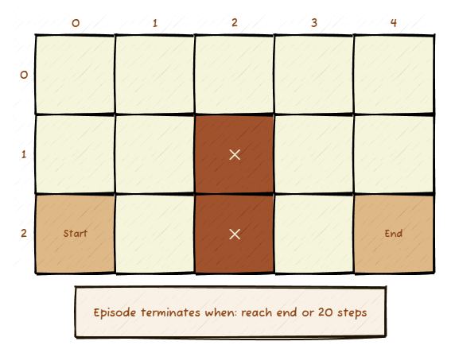
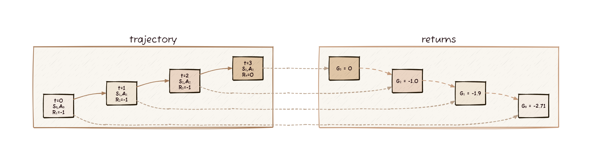
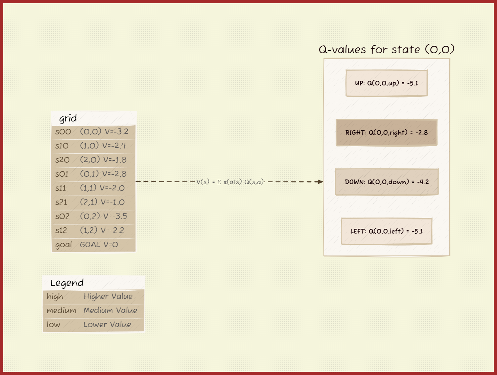
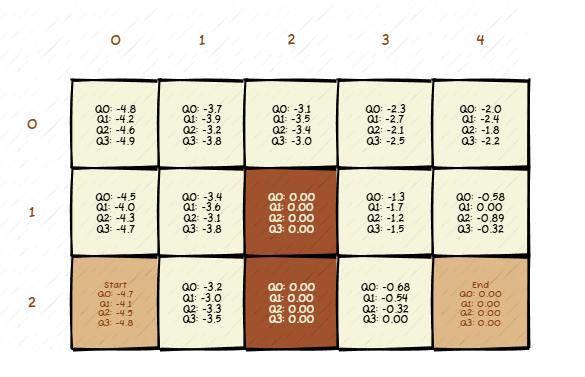
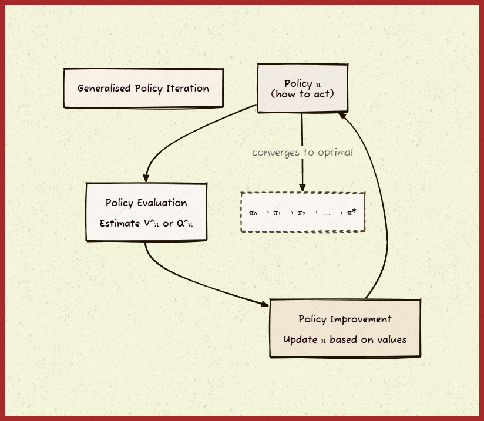

# Reinforcement Learning

## Understanding the RL Framework

Reinforcement learning is fundamentally about an agent learning to make decisions through interaction with an environment. The core concept is captured in this agent-environment loop:


The agent observes the current state, takes an action, and receives feedback in the form of a reward and the next state. This cycle continues, with the agent gradually learning which actions lead to better outcomes.

## The Markov Decision Process (MDP)

Formally, this interaction follows a Markov Decision Process, where the sequence unfolds as:

```
S₀ → A₀ → R₁, S₁ → A₁ → R₂, S₂ → A₂ → R₃, S₃ → ...
```

Where:
- **S₀, S₁, S₂, ...** are states the agent observes
- **A₀, A₁, A₂, ...** are actions the agent takes
- **R₁, R₂, R₃, ...** are rewards received after each action

The agent's goal is to learn a policy π(a|s) - the **probability** of taking action a in state s - that maximises the expected **cumulative reward** over time.

The **cumulative reward** (often written as G_t) is the total reward the agent receives from time step t onwards:

```
G_t = R_{t+1} + γR_{t+2} + γ²R_{t+3} + ... = Σ γ^k R_{t+k+1} (from k=0 to ∞)
```

Where γ (gamma) is the **discount factor** (0 ≤ γ ≤ 1) that makes future rewards worth less than immediate rewards. If γ = 0.9, then a reward tomorrow is worth 90% of the same reward today.

This learning happens through trial and error, using the reward signal to update the agent's understanding of which actions are valuable in which states. The agent doesn't just want immediate reward - it wants to maximise the total reward it will accumulate over the entire episode or continuing interaction.

In short, the goal is to find the **policy** which maximises the **return** `(G_t)`.

## The Markov Property

The MDP framework relies on a crucial assumption called the **Markov Property**, which states that the future depends only on the present state, not on the history of how we got there.


This diagram illustrates the Markov Property: although past history informs the current state (e.g. encoding velocity and direction), the prediction of the next state depends only on the current state and action. This makes the system "memoryless" in that the past need not be explicitly considered beyond its influence on the present state.

```
P(next_state | current_state, action) = P(next_state | current_state, action, all_history)
```

Formally: 

```
P(S_{t+1} | S_t, A_t) = P(S_{t+1} | S_t, A_t, S_{t-1}, A_{t-1}, S_{t-2}, A_{t-2}, ...)
```

This means the current state S_t contains all the information needed to predict the next state and reward. The system is "memoryless" - knowing the entire history doesn't give us any additional predictive power beyond what the current state already tells us.


**Why this matters:**
- Enables efficient algorithms that only need to consider the current state
- Justifies why we can learn value functions V(s) and Q(s,a) for individual states
- Explains why state representation is critical - states must capture all relevant information

**Real-world considerations:**
In practice, the Markov property is often an approximation. For example, in a game, the current screen might not capture momentum or hidden opponent strategies. However, we can usually engineer states (e.g., including recent frames or velocity information) that satisfy the Markov property well enough for RL algorithms to work effectively.

## Example: Gridworld Environment

To solidify the concepts introduced above, we'll now walk through a simple Gridworld environment. This illustrates how an agent learns to navigate a space, receiving rewards and penalties as it explores and refines its policy.



### State and Action Representation

In our gridworld:
- **State**: Two numbers representing the agent's (x, y) coordinates on the grid
- **Action**: A single number (0, 1, 2, 3) representing movement directions (up, down, left, right)
- **Reward**: -1 for each step taken, 0 when reaching the target (encouraging the agent to reach the goal as quickly as possible)

This reward structure creates an interesting learning problem: the agent must balance moving toward the goal while avoiding walls and dead ends that would waste steps.

### The Transition Function

The environment's dynamics are captured by the transition function:

```
p(s', r | s, a)
```

This represents the probability of transitioning to state s' and receiving reward r, given that we're in state s and take action a. For example:
- From state (0,0), taking action "right" leads to state (1,0) with reward -1
- From state (1,1), taking action "right" hits a wall, keeping us at (1,1) with reward -1

### World Models vs Model-Free Learning

One aspect of this problem is how different approaches handle environmental knowledge:

**With a World Model**: At a glance, we humans can look at the grid and immediately understand the optimal path. We have an internal "world model" - an understanding of how the environment works. We know that moving right from (0,0) will take us to (1,0), and that trying to move right from (1,1) will fail due to the wall. When an AI agent develops this understanding, we say it has learned a world model of the environment.

**Model-Free Learning**: Without a world model, the agent must learn purely through trial and error. It won't know how the maze looks like at a glance, it won't know what the state and action numbers represent or how they relate to one another, and it won't know how the rewards work. Initially, it might achieve terrible scores (like consistent -20s) as it fumbles its way around the grid. However, through this exploration, it records everything it experiences - these recorded experiences are called **samples**, and sequences of these samples form **sample trajectories**. Eventually, through stacking multiple iterations of accumulated experience, the agent discovers better strategies.

### Key Learning Challenges

This simple gridworld provides several fundamental challenges in reinforcement learning:

#### 1. The Exploration/Exploitation Tradeoff
Should the agent try a new, potentially better path (exploration) or stick with a known decent path (exploitation)? Early in learning, the agent must explore extensively to discover good strategies. Later, it needs to balance trying new things with using what it has learned.

#### 2. The Credit Assignment Problem
When the agent finally reaches the goal, which of the many actions it took along the way deserve credit for the success? The action that entered the goal cell? The action several steps earlier that avoided a dead end? This is particularly challenging when rewards are sparse - our agent only gets meaningful feedback upon reaching the goal.

#### 3. Temporal Difference Learning
Rather than waiting until the end of an episode to learn, the agent can learn from each step by comparing its current estimate of state value with what it observes after taking an action. If the agent thought state (1,0) was worth -5 steps to the goal, but after moving there and looking ahead it seems like it will take -4 steps, the agent can immediately update its estimate.

#### 4. Sample Efficiency
How quickly can the agent learn from its experiences? A sample-efficient algorithm might solve the gridworld in 100 episodes, while an inefficient one might need 10,000. This becomes crucial in real-world applications where each sample might be expensive (robot actions, medical treatments, etc.).

### Learning Through Experience

As the agent explores, it gradually builds up knowledge about state values and action preferences. Initially random, its policy slowly improves:

```
Random Policy → Slightly Better → Finds Goal Occasionally → Reliable Path → Optimal Policy
```

This progression from random exploration to optimal behavior captures the essence of reinforcement learning: using the reward signal to guide the development of increasingly sophisticated decision-making strategies.

The gridworld, despite its simplicity, contains all the essential elements of more complex RL problems - states, actions, rewards, sequential decision-making, and the challenge of learning good policies through environmental interaction.

## Sample Trajectories and Return Calculations

Now that we understand the theoretical framework, let's see how reinforcement learning actually works in practice by examining **sample trajectories** - sequences of states, actions, and rewards that the agent experiences during episodes.



### What is a Sample Trajectory?

A sample trajectory is a complete record of an agent's experience during one episode:

```
τ = (S₀, A₀, R₁, S₁, A₁, R₂, S₂, A₂, R₃, ..., S_T)
```

Where T is the final time step when the episode ends. Let's examine two trajectories from our gridworld example.

### Example: A Successful Trajectory

Here's a trajectory where the agent successfully reaches the goal, where we begin at (0,0) and end at (2,2):

```
Step | State | Action | Reward | Next State
-----|-------|--------|--------|------------
  0  | (0,0) | right  |   -1   |   (1,0)
  1  | (1,0) | right  |   -1   |   (2,0)
  2  | (2,0) | down   |   -1   |   (2,1)
  3  | (2,1) | down   |    0   |   GOAL
```

**Total steps**: 4  
**Total reward**: -3  
**Episode length**: 4 time steps

### Calculating Returns: Working Backwards

The key insight in reinforcement learning is that we need to calculate the **return** (cumulative discounted reward) for each state-action pair. We do this by working backwards from the end of the trajectory.

### Notation reminder:

**G_t** = Return (total discounted reward) from time step t onwards
**R_{t+1}** = Immediate reward received after taking action at time t
**γ** = Discount factor (0.9 in this example)
**γG_{t+1}** = Discounted value of future returns

Let's calculate returns with γ = 0.9:

#### Step 3: Final Step (reaching goal)
```
G₃ = R₄ = 0
```
The agent receives 0 reward for reaching the goal, and there are no future rewards.

#### Step 2: One step before goal
```
G₂ = R₃ + γG₃ = -1 + 0.9 × 0 = -1
```
The agent gets -1 for this step, plus the discounted value of reaching the goal.

#### Step 1: Two steps before goal
```
G₁ = R₂ + γG₂ = -1 + 0.9 × (-1) = -1 + (-0.9) = -1.9
```

#### Step 0: Three steps before goal
```
G₀ = R₁ + γG₁ = -1 + 0.9 × (-1.9) = -1 + (-1.71) = -2.71
```

### Complete Return Calculation Summary

| Time Step | State | Action | Immediate Reward | Return (G_t) |
|-----------|-------|--------|------------------|--------------|
|     0     | (0,0) | right  |        -1        |    -2.71     |
|     1     | (1,0) | right  |        -1        |    -1.9      |
|     2     | (2,0) | down   |        -1        |    -1.0      |
|     3     | (2,1) | down   |         0        |     0.0      |

### The Impact of the Discount Factor

Let's see how different values of γ affect the same trajectory:

#### With γ = 0.5 (More Short-sighted)
```
G₃ = 0
G₂ = -1 + 0.5 × 0 = -1.0
G₁ = -1 + 0.5 × (-1) = -1.5
G₀ = -1 + 0.5 × (-1.5) = -1.75
```

#### With γ = 0.99 (More Far-sighted)
```
G₃ = 0
G₂ = -1 + 0.99 × 0 = -1.0
G₁ = -1 + 0.99 × (-1) = -1.99
G₀ = -1 + 0.99 × (-1.99) = -2.97
```

**Key Observation**: Lower γ values make the agent more "impatient" - future rewards matter less, so the total return is closer to just the immediate rewards. Higher γ values make future consequences matter more.

### Example: A Failed Trajectory

Now let's examine a trajectory where the agent gets stuck or takes a poor path, where we begin at (0,0) and end at (2,0):

```
Step | State | Action | Reward | Next State
-----|-------|--------|--------|------------
  0  | (0,0) | up     |   -1   |   (0,0)  [hits wall]
  1  | (0,0) | left   |   -1   |   (0,0)  [hits wall]
  2  | (0,0) | up     |   -1   |   (0,0)  [hits wall]
  3  | (0,0) | right  |   -1   |   (1,0)
  4  | (1,0) | left   |   -1   |   (0,0)
  5  | (0,0) | down   |   -1   |   (0,1)
  6  | (0,1) | down   |   -1   |   (0,2)
  7  | (0,2) | right  |   -1   |   (1,2)
  8  | (1,2) | right  |   -1   |   (2,2)
  9  | (2,2) | up     |   -1   |   (2,1)
 10  | (2,1) | up     |    0   |   GOAL
```

**Total steps**: 11  
**Total reward**: -10

Working backwards with γ = 0.9:
```
G₁₀ = 0
G₉ = -1 + 0.9 × 0 = -1.0
G₈ = -1 + 0.9 × (-1) = -1.9
G₇ = -1 + 0.9 × (-1.9) = -2.71
...continuing backwards...
G₀ = -8.74  (much worse than the efficient path!)
```

### What This Tells Us About Learning

These calculations reveal several crucial insights:

1. **Path Quality Matters**: The successful 4-step path has G₀ = -2.71, while the wasteful 11-step path has G₀ = -8.74. The agent will learn to prefer actions that lead to higher returns.

2. **Credit Assignment**: Each action gets credit (or blame) for all future rewards it influences. The first action in the successful trajectory gets credit for eventually reaching the goal efficiently.

3. **Temporal Structure**: Actions taken earlier in the trajectory have their returns calculated based on everything that happens afterwards. This creates a natural temporal credit assignment.

4. **Learning Signal**: The difference between returns from good and bad trajectories provides the learning signal. The agent will adjust its policy to make high-return trajectories more likely.

### From Trajectories to Learning

These return calculations form the foundation for learning algorithms:

- **Monte Carlo methods** collect complete trajectories and use these exact return calculations to update value estimates
- **Temporal Difference methods** estimate returns without waiting for episode completion
- **Policy Gradient methods** use these returns to determine which actions to make more or less likely

The key insight is that by experiencing many trajectories and calculating their returns, the agent gradually learns which states are valuable and which actions lead to better outcomes. The discount factor γ allows us to balance immediate vs. long-term consequences, shaping how the agent prioritises different types of rewards.

## Value Functions: Estimating Expected Returns

In the previous section, we calculated exact returns for specific trajectories. But to make good decisions, our agent needs to know the *expected* return from any given state or state-action pair. This is where **value functions** come in - they estimate the long-term value of being in particular situations.

### The State Value Function V(s)

The **state value function** V^π(s) represents the expected return when starting from state s and following policy π:

```
V^π(s) = E_π[G_t | S_t = s]
```

In plain English: "If I'm in state s and follow policy π from here onwards, what return can I expect on average?"

Let's revisit our gridworld example. We calculated that one trajectory from (0,0) gave us G_0 = -2.71; but that was just one possible path. The true value V(0,0) would be the average return across all possible trajectories starting from (0,0).

If our agent has learned a good policy, we might find:
- V(0,0) = -3.2 (expected steps to goal from starting position)
- V(1,0) = -2.4 (one step closer, so higher value)
- V(2,1) = -1.0 (very close to goal)
- V(goal) = 0 (no more steps needed)

### The Action Value Function Q(s,a)

The **action value function** (also called the Q-function) represents the expected return when taking action a in state s, then following policy π:

```
Q^π(s,a) = E_π[G_t | S_t = s, A_t = a]
```

This answers: "If I'm in state s, take action a, then follow my policy, what return can I expect?"

Using our gridworld trajectory where we went from (0,0) with action "right":
- Q(0,0, right) might be -2.8 (leads toward an efficient path)
- Q(0,0, up) might be -5.1 (hits wall, wastes time)
- Q(0,0, left) might be -5.1 (hits wall, wastes time)
- Q(0,0, down) might be -4.2 (viable but longer path)



### The Relationship Between V and Q

These value functions are intimately connected. If we know all the Q-values for a state, we can compute the state value:

```
V^π(s) = Σ_a π(a|s) Q^π(s,a)
```

This says: "The value of a state is the average of all action values, weighted by how likely the policy is to take each action."

Conversely, if we know V for all states, we can express Q as:

```
Q^π(s,a) = E[R_{t+1} + γV^π(S_{t+1}) | S_t = s, A_t = a]
```

This is the **Bellman equation** for action values: "The Q-value equals the expected immediate reward plus the discounted value of where we end up."

### From Sample Returns to Value Estimates

Remember our trajectory calculations? Each return G_t we calculated was actually a **sample** of the true value function:

```
G_0 = -2.71 is a sample of V(0,0)
G_1 = -1.9 is a sample of V(1,0)
G_2 = -1.0 is a sample of V(2,0)
```

If we collect many trajectories and average the returns from each state, we get increasingly accurate estimates of the true value function. This is the foundation of **Monte Carlo** value estimation.

### Example: Learning State Values

Let's say our agent runs multiple episodes and observes these returns from state (1,0):

```
Episode 1: G_t = -1.9  (efficient path)
Episode 2: G_t = -4.2  (took a detour)
Episode 3: G_t = -2.1  (mostly efficient)
Episode 4: G_t = -1.8  (very efficient)
Episode 5: G_t = -3.5  (some backtracking)
```

Our estimate of V(1,0) would be:
```
V(1,0) ≈ (-1.9 + -4.2 + -2.1 + -1.8 + -3.5) / 5 = -2.7
```

As we collect more samples, this estimate becomes more accurate.

### The Optimal Value Functions

The **optimal state value function** V*(s) represents the best possible expected return from state s:

```
V*(s) = max_π V^π(s)
```

Similarly, the **optimal action value function** Q*(s,a) represents the best possible expected return when taking action a in state s:

```
Q*(s,a) = max_π Q^π(s,a)
```

These optimal value functions satisfy the **Bellman optimality equations**:

```
V*(s) = max_a E[R_{t+1} + γV*(S_{t+1}) | S_t = s, A_t = a]
Q*(s,a) = E[R_{t+1} + γ max_{a'} Q*(S_{t+1}, a') | S_t = s, A_t = a]
```

### Why Value Functions Matter

Value functions are crucial because:

1. **Policy Improvement**: If we know Q*(s,a), the optimal policy is simply to always choose the action with the highest Q-value: π*(s) = argmax_a Q*(s,a)

2. **Efficient Learning**: Instead of learning about complete trajectories, we can learn about individual states and actions

3. **Planning**: Value functions let us evaluate "what if" scenarios without actually taking actions

4. **Credit Assignment**: They help us understand which states and actions are truly valuable

### From Values to Actions

In our gridworld, once we've learned good value estimates, decision-making becomes straightforward:

```python
def choose_action(state, Q_values):
    """Choose the action with highest Q-value"""
    available_actions = get_valid_actions(state)
    best_action = max(available_actions, 
                     key=lambda a: Q_values[state][a])
    return best_action
```

But how do we learn these value functions efficiently? We could wait for complete episodes like we did with our trajectory calculations, but that's slow. In the next section, we'll see how **temporal difference learning** allows us to update our value estimates after every single step, dramatically speeding up the learning process.

## Three Approaches to Reinforcement Learning

After understanding value functions, we can now explore how different RL algorithms use them. The image above shows three fundamental approaches that represent different philosophies about how to solve the reinforcement learning problem.

### 1) Pure Policy Gradient Methods

**What it means:** Directly learn the policy π(a|s) without explicitly learning value functions. The algorithm adjusts the probability of taking each action based on the returns observed from complete trajectories.

Let's see this in action with our gridworld example. Imagine our agent tries the same starting state (0,0) multiple times:

```
Episode 1: (0,0) → right → ... → GOAL  (Return: G₀ = -2.71)
Episode 2: (0,0) → right → ... → GOAL  (Return: G₀ = -8.74) [took detours]
Episode 3: (0,0) → up → ... → GOAL     (Return: G₀ = -12.3) [hit wall first]
Episode 4: (0,0) → right → ... → GOAL  (Return: G₀ = -3.1)
```

**The variance problem:** Even when taking the same action "right" from (0,0), the returns vary dramatically (-2.71, -8.74, -3.1). This high variance makes learning unstable because:

- Sometimes "right" looks amazing (G₀ = -2.71)
- Sometimes "right" looks terrible (G₀ = -8.74)
- The algorithm struggles to determine if "right" is actually a good action

**Why "more dependent on policy function":** The algorithm has no value function to fall back on. It must:
- Collect complete trajectories to calculate returns
- Update policy probabilities directly based on these noisy return estimates
- Hope that averaging over many episodes will reveal the true action values

**Example Algorithm:** REINFORCE is the classic policy gradient method. It updates the policy using:

```
π(a|s) ∝ π(a|s) × G_t
```

If action `a` in state `s` led to a high return G_t, increase its probability. If it led to a low return, decrease its probability.

### 2) Actor-Critic Methods (Policy + Value Function)

**What it means:** Learn both a policy (the "actor") and value function (the "critic"). The actor decides what action to take, while the critic evaluates how good the current state or action is.

**How they work together:**
- **Actor (Policy):** "I think we should go right from (0,0)"
- **Critic (Value Function):** "Based on my estimates, (0,0) is worth about -3.2, and going right should give us about -2.8"
- **Learning:** Compare what actually happened with what the critic expected

**Accounts for variance:** Instead of using the raw return G_t (which has high variance), actor-critic methods use the **advantage**:

```
Advantage = G_t - V(s)
```

Going back to our gridworld example:

```
Episode 1: G₀ = -2.71, V(0,0) = -3.2, Advantage = -2.71 - (-3.2) = +0.49
Episode 2: G₀ = -8.74, V(0,0) = -3.2, Advantage = -8.74 - (-3.2) = -5.54
```

The advantage tells us whether this particular trajectory was better or worse than expected:
- Episode 1: +0.49 means "better than expected, reinforce this action"
- Episode 2: -5.54 means "worse than expected, reduce probability of this action"

**Balance:** The system learns two things simultaneously:
- **Policy improvement:** Use advantages to update action probabilities
- **Value learning:** Update V(s) estimates based on observed returns

**Example visualisation:**

```
State (0,0):
Actor says: π(right|0,0) = 0.6, π(down|0,0) = 0.3, π(up|0,0) = 0.05, π(left|0,0) = 0.05
Critic says: V(0,0) = -3.2

After taking "right" and observing G₀ = -2.71:
Advantage = -2.71 - (-3.2) = +0.49 (better than expected!)
→ Increase π(right|0,0) slightly
→ Update V(0,0) towards the observed return
```

**Example Algorithms:** A2C (Advantage Actor-Critic), A3C (Asynchronous Advantage Actor-Critic), PPO (Proximal Policy Optimisation)

### 3) Value-Based Methods (Q-Learning Family)

**What it means:** Learn Q(s,a) values and derive the policy implicitly through greedy action selection: π(s) = argmax_a Q(s,a). There's no explicit policy representation - the policy emerges from always choosing the action with the highest Q-value.

**How it works in our gridworld:**



```
Learned Q-values for state (0,0):
Q(0,0, right) = -2.8
Q(0,0, down)  = -4.2  
Q(0,0, up)    = -5.1  (hits wall)
Q(0,0, left)  = -5.1  (hits wall)

Implicit policy: Always choose argmax_a Q(0,0, a) = "right"
```

**Policy becomes dependent:** The policy is completely determined by the Q-values:

```
def policy(state, Q_table):
    return argmax(Q_table[state])  # Always pick best Q-value
```

No matter how we learned those Q-values, the policy will always be greedy with respect to them.

**More dependent on value function:** Everything hinges on getting Q-values right:

- If Q(0,0, right) = -2.8 is accurate → good policy
- If Q(0,0, right) = -10.0 due to poor learning → terrible policy
- No policy parameters to provide alternative guidance

**Learning process:** Q-learning updates use the Bellman equation:

```
Q(s,a) ← Q(s,a) + α[R + γ max_a' Q(s',a') - Q(s,a)]
                    ↑
                   TD Error
```

The temporal difference (TD) error compares current Q-estimate with observed reward plus best future Q-value.

**Example Algorithms:** Q-Learning, Deep Q-Networks (DQN), Double DQN, Dueling DQN

### Comparing the Approaches

Let's see how each approach would handle the same learning situation in our gridworld:

**Scenario:** Agent is in state (0,0) and needs to decide between "right" (good) and "up" (hits wall).

| Method | How it Learns | What it Stores | Decision Process |
|--------|---------------|----------------|------------------|
| **Policy Gradient** | Collect trajectories, calculate returns, adjust action probabilities | π(a\|s) probabilities | Sample from π(right\|0,0) = 0.7, π(up\|0,0) = 0.3 |
| **Actor-Critic** | Learn policy and value function together using advantages | π(a\|s) + V(s) or Q(s,a) | Actor samples from π, Critic evaluates choices |
| **Value-Based** | Learn Q-values, policy emerges from greedy selection | Q(s,a) values only | Always choose argmax Q(0,0, a) = "right" |

### Trade-offs and Considerations

**Sample Efficiency:**
- **Value-based:** Often most sample efficient for discrete actions
- **Actor-Critic:** Moderate sample efficiency, good stability
- **Policy Gradient:** Can be sample inefficient due to variance

**Continuous Actions:**
- **Policy Gradient:** Natural fit for continuous action spaces
- **Actor-Critic:** Handles continuous actions well
- **Value-based:** Requires discretisation or special techniques (like DDPG)

**Exploration:**
- **Value-based:** Needs explicit exploration strategy (ε-greedy, UCB)
- **Policy Gradient:** Natural stochastic exploration from policy
- **Actor-Critic:** Inherits exploration from policy component

**Stability:**
- **Value-based:** Can be unstable with function approximation
- **Actor-Critic:** Generally more stable than pure policy methods
- **Policy Gradient:** Can have high variance but stable convergence

### The Evolution of RL Algorithms

This spectrum represents the historical evolution of RL thinking:

1. **Early days:** Value-based methods dominated (Q-learning, TD learning)
2. **Policy renaissance:** Direct policy search gained popularity (REINFORCE, evolutionary methods)  
3. **Modern synthesis:** Actor-critic methods combine the best of both worlds

Understanding these three paradigms is crucial because:

- Most modern algorithms are variations or combinations of these approaches
- The choice between them depends on your specific problem characteristics
- Hybrid methods (like Soft Actor-Critic) blend multiple philosophies

In the next sections, we'll dive deeper into specific algorithms from each category, starting with the temporal difference learning that powers value-based methods.

---

*This provides the foundation for understanding why algorithms like Q-learning, REINFORCE, and A2C work the way they do. Each approach represents a different philosophy about the most effective way to learn optimal behavior through environmental interaction.*

## Generalised Policy Iteration: The Unifying Framework

Now that we've seen three different approaches to reinforcement learning, we can reveal the fundamental principle that underlies them all: **Generalised Policy Iteration (GPI)**. Every RL algorithm, regardless of its specific implementation, follows the same basic cycle of two interacting processes.



### The Two-Process Cycle

GPI describes the interaction between:

**Policy Evaluation**: Estimating the value function for the current policy
```
"How good is my current way of acting?"
```

**Policy Improvement**: Updating the policy based on the current value estimates  
```
"How can I act better given what I know?"
```

These processes work together in a continuous cycle:

```
Policy Evaluation ⟷ Policy Improvement
     ↓                    ↑
 Estimate V^π or Q^π   Update π to be 
   for current π       greedy w.r.t values
```

### How Each Approach Implements GPI

Looking back at our three approaches, we can now see how each implements this fundamental cycle:

**Value-Based Methods (Q-Learning)**:
- **Policy Evaluation**: Q-value updates estimate Q^π (implicitly)
- **Policy Improvement**: Greedy action selection π(s) = argmax_a Q(s,a)

**Policy Gradient Methods**:
- **Policy Evaluation**: Calculate returns G_t to evaluate current policy performance
- **Policy Improvement**: Gradient updates directly adjust policy parameters

**Actor-Critic Methods**:
- **Policy Evaluation**: Critic explicitly learns V^π or Q^π  
- **Policy Improvement**: Actor updates policy using critic's evaluations

### From Q^π to Q*: The Learning Progression

The genius of GPI is how it naturally progresses from evaluating any policy to finding the optimal policy:

```
Start with random policy π₀
↓
Evaluate: Estimate Q^π₀(s,a) 
↓
Improve: Create π₁ that's greedy w.r.t Q^π₀
↓
Evaluate: Estimate Q^π₁(s,a) [better than Q^π₀]
↓
Improve: Create π₂ that's greedy w.r.t Q^π₁
↓
... continue until convergence ...
↓
Final result: π* and Q*(s,a)
```

Each iteration of this cycle produces:
- A policy that's at least as good as the previous one
- Value estimates that are more accurate for better policies
- Eventual convergence to the optimal policy π* and optimal values Q*

### Why This Framework Matters

Understanding GPI reveals several key insights:

1. **All RL algorithms are doing the same thing** - they just differ in how they implement evaluation and improvement

2. **The approaches can be combined** - you can use any evaluation method with any improvement method

3. **Convergence is guaranteed** under certain conditions - the two processes naturally drive each other toward optimality

4. **Efficiency differences** come from how quickly and accurately each approach performs evaluation and improvement

### The Asynchronous Reality

In practice, most modern algorithms don't strictly alternate between complete evaluation and improvement phases. Instead, they perform **asynchronous GPI**:

- **Q-Learning**: Every update simultaneously evaluates the current policy and improves it
- **Actor-Critic**: Actor and critic update continuously, not in discrete phases  
- **Policy Gradient**: Each gradient step slightly improves the policy based on recent evaluations

This asynchronous approach is more sample-efficient than waiting for complete policy evaluation before making improvements.

The beauty of GPI is that it works whether the processes are perfectly separated or completely interleaved - the fundamental cycle remains the same, driving the agent toward optimal behavior through the natural interaction of evaluation and improvement.