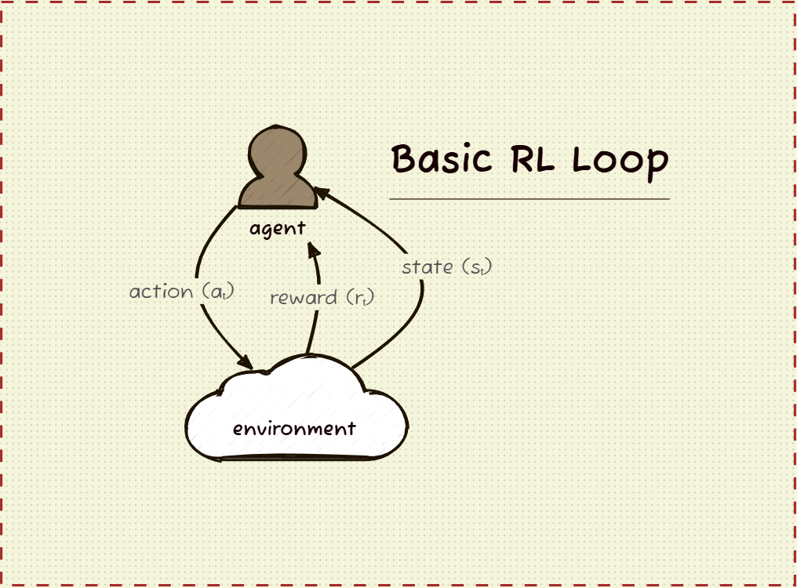
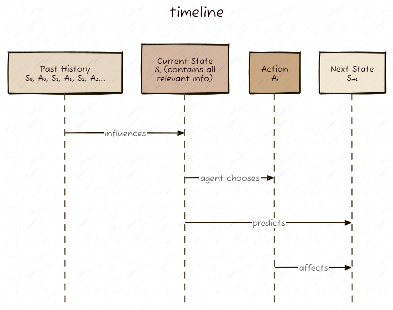
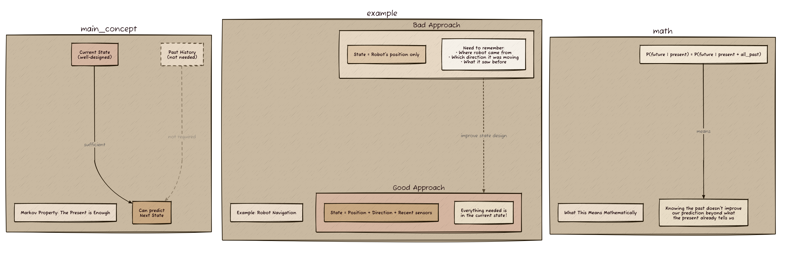

# Reinforcement Learning

## Understanding the RL Framework

Reinforcement learning is fundamentally about an agent learning to make decisions through interaction with an environment. The core concept is captured in this agent-environment loop:



The agent observes the current state, takes an action, and receives feedback in the form of a reward and the next state. This cycle continues, with the agent gradually learning which actions lead to better outcomes.

## The Markov Decision Process (MDP)

Formally, this interaction follows a Markov Decision Process, where the sequence unfolds as:

```
S₀ → A₀ → R₁, S₁ → A₁ → R₂, S₂ → A₂ → R₃, S₃ → ...
```

Where:
- **S₀, S₁, S₂, ...** are states the agent observes
- **A₀, A₁, A₂, ...** are actions the agent takes
- **R₁, R₂, R₃, ...** are rewards received after each action

The agent's goal is to learn a policy π(a|s) - a mapping from states to actions - that maximises the expected cumulative reward over time. This learning happens through trial and error, using the reward signal to update the agent's understanding of which actions are valuable in which states.

## The Markov Property

The MDP framework relies on a crucial assumption called the **Markov Property**, which states that the future depends only on the present state, not on the history of how we got there.



```
P(next_state | current_state, action) = P(next_state | current_state, action, all_history)
```

Formally: 

```
P(S_{t+1} | S_t, A_t) = P(S_{t+1} | S_t, A_t, S_{t-1}, A_{t-1}, S_{t-2}, A_{t-2}, ...)
```

This means the current state S_t contains all the information needed to predict the next state and reward. The system is "memoryless" - knowing the entire history doesn't give us any additional predictive power beyond what the current state already tells us.



**Why this matters:**
- Enables efficient algorithms that only need to consider the current state
- Justifies why we can learn value functions V(s) and Q(s,a) for individual states
- Explains why state representation is critical - states must capture all relevant information

**Real-world considerations:**
In practice, the Markov property is often an approximation. For example, in a game, the current screen might not capture momentum or hidden opponent strategies. However, we can usually engineer states (e.g., including recent frames or velocity information) that satisfy the Markov property well enough for RL algorithms to work effectively.

---